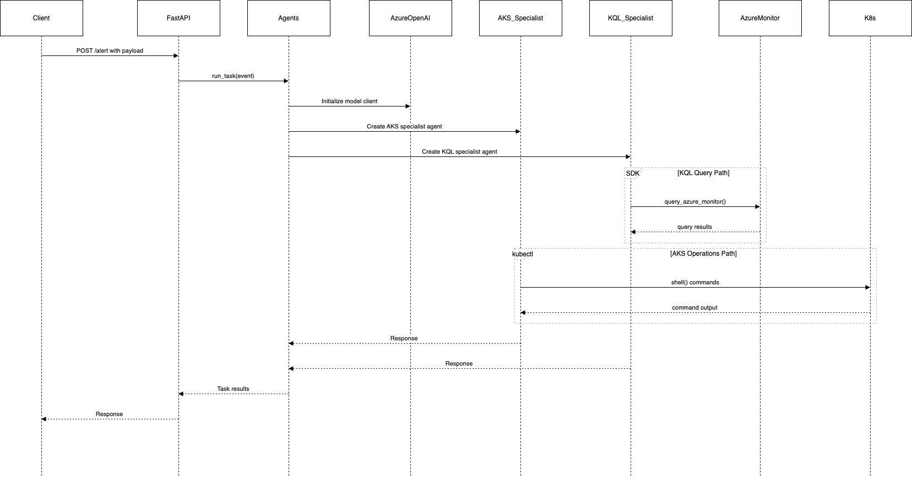

# MAS Multi-Agents MVP
Multi-agent architecture using Magentic-One agent from Autogen

## Pre-requisites for development
VSCode
python 3.13.2


## How to run it local

- Define the following environment variables either in a .env file or directly in the docker run:

      ```
      AZURE_OPENAI_DEPLOYMENT=
      AZURE_OPENAI_MODEL=
      AZURE_OPENAI_API_VERSION=
      AZURE_OPENAI_ENDPOINT=
      AZURE_OPENAI_API_KEY=
      PORT=8080
      ``` 

- Build and run the image
   ```
   docker build -t mas-app .
   docker run --env-file .env -p 8080:8080 mas-app
   ```

- Send a payload to test it:

   ```
   curl -X POST http://localhost:8080 \           
   -H "Content-Type: application/json" \
   -d '{"task":"Write a Python script to fetch data from an API."}'
   ```

## Architecture overview

The archicture runs the mas in Azure Kubernetes Service as a deployment. It is a full stateless application at the Kubernetes level and it trusts on external services to persist any information such as secrets or AI Agents history. The agents uses AKS workload identity model to access resources needed to perform their jobs.


## Sequence diagram

This sequence diagram gives a overview of how the application uses a multi-agent archicture to solve a problem.

